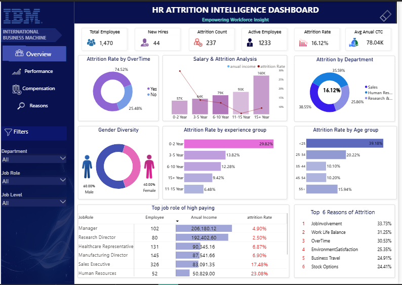
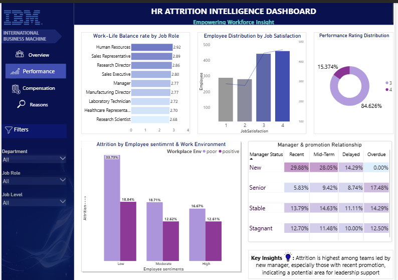
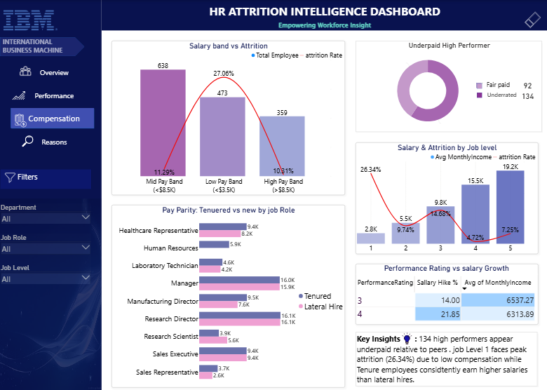
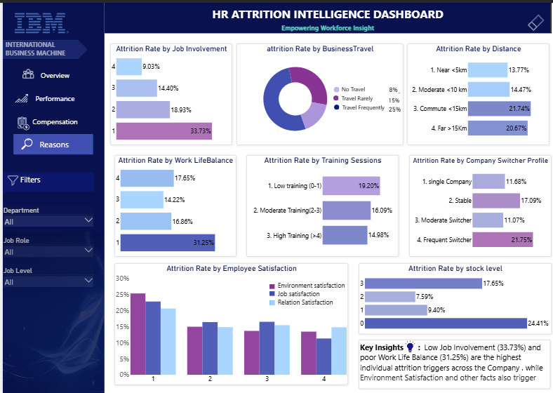

# IBM HR Attrition Diagnostic & Intelligence Dashboard

Data-Driven Strategic HR Analytics using SQL, Python (Pandas), and Power BI
A comprehensive 4-page diagnostic dashboard designed to uncover root causes of workforce turnover, analyze pay equity gaps, and provide actionable retention frameworks for HR leadership.

## 🛠️ Tech Stack & Project Files
- Data Processing & Preprocessing: HR_Data_preprocessing.ipynb (Python/Pandas for handling missing values, data cleaning, and feature engineering)

- SQL Transformations: HR_analysis.sql (Database queries for aggregations, pay gaps, and validation)

- Data Visualization & Analytics: HR_Attrition_Dashboard.pbix (Power BI interactive model with custom DAX, unpivoted satisfaction metrics, and conditional columns)

## 📑 Deep-Dive Page-by-Page Analysis & Visual Breakdown
### PAGE 1: OVERVIEW & KEY DRIVERS 

#### 📊 Visual Breakdown & Insights:

- **KPI Metrics (Headcount, Attrition Rate, Avg Salary):**  

   Overall Company Attrition Rate: **16.12%** (Total Turnover)
 
   The Target: Industry benchmark standard is $<12\%$. The **4.12% gap** represents significant unnecessary operational loss and hiring costs that this diagnostic project aims to eliminate.

- **Top Department & Role Vulnerability:**  Sales Department exhibits the highest turnover rate. Specifically, the Sales Representative role suffers from the highest attrition rate alongside the lowest annual income across all roles.

- **Tenure Friction Point (0-2 Years Experience):** Employees with 0 to 2 years of experience show a steep attrition rate of ~29.82%, which is significantly higher than any other tenure bucket.

- **Compensation vs. Experience:** Salary bands show healthy upward growth as total experience increases, proving that salary progression stabilizes in mid-to-senior tiers.

- **Overtime & Demographics:**  Overtime workers and younger age cohorts consistently display higher-than-average attrition probabilities.

#### 💡HR Action:
-  **Entry-Level Intervention:** Focus initial retention efforts on onboarding and salary baseline reviews for 0-2 year experienced employees and Sales Representatives.

- **Overtime Capping:**  Introduce overtime limit alerts for younger employee segments to curb burnout.

### PAGE 2: PERFORMANCE & CAREER DYNAMICS 

#### 📊 Visual Breakdown & Insights:

- **Employee Sentiment & Workplace Mitigation:** Low employee sentiment (combination of Job Satisfaction & Relationship Satisfaction) directly inflates attrition. However, data proves that a high-quality workplace environment acts as a buffer—mitigating turnover even when personal sentiment drops.

- **Manager & Promotion Relationship:** A recent promotion paired with a new manager assignment creates a spike in attrition. However, a stable, strong relationship with an existing manager acts as a key anchor, keeping newly promoted employees from leaving.

- **Job Satisfaction Distribution:** Overall distribution is positive, with the majority of employees falling under high ratings (3 and 4).

- **Work-Life Balance Crisis (2.68 - 2.98 Avg Rating):**  Across all job roles, Work-Life Balance scores are consistently low (averaging between 2.68 and 2.98). This uniformity proves the issue is systemic across the entire organization, rather than isolated to a specific department.

-  **Top Performer Distribution:**  Company top performers (Rating 4) make up 15.37% of the workforce.

#### 💡 HR Action:
- **Post-Promotion Onboarding:**  Implement structured transition programs when promoted employees are assigned to new managers.

- Systemic Work-Life Balance Review: Address organization-wide work hours and flexible policies, as all roles suffer from sub-3.0 balance scores.

### PAGE 3: COMPENSATION & PAY EQUITY 

#### 📊 Visual Breakdown & Insights:

- **Salary Band Distribution:** The majority of the workforce sits in the Mid Pay Band. However, the Low Salary Band experiences nearly double the attrition rate compared to Mid/High bands, establishing low pay as a major exit trigger.

- **The 134 Underrated Top Performers Risk:**  Out of the 15.37% top performers, 134 high-performing employees are underpaid (concentrated in Job Levels 1, 2, and 3).

#### **Critical Finding:**
- In Job Level 1, ~30% of these underpaid top performers have already resigned, representing a severe financial and talent loss for the company.

- **Tenured vs. Lateral Hire Pay Parity:** Tenured employees enjoy competitive, market-aligned compensation. However, lateral hires receive slightly lower starting salaries relative to internal peers, creating potential onboarding tension over time.

- **Salary Hike vs. Attrition:**  Performance ratings trigger higher percentage salary hikes, but salary hikes alone fail to reduce attrition if the base salary remains below market parity.

#### 💡 HR Action:
- **Immediate Salary Correction:** Conduct an urgent pay equity adjustment for the identified 134 underpaid top performers to prevent further high-value turnover.

- **Job Level 1 Base Increase:** Restructure entry-level baseline salaries to close the 30% exit gap.

### PAGE 4: DIAGNOSTIC REASONS & COMPOUNDING RISK 

#### 📊 Visual Breakdown & Insights:

- **Commute Distance Threshold (>10 km):** Attrition surges significantly once employee commute distance crosses 10 km.

- **Career Switching Profiles:**  Frequent switchers (5+ past companies) show a 21.75% attrition rate. Even stable switchers (1-2 past companies) show a notable ~17% rate.

- **Satisfaction Hierarchy Impact:**  Unpivoted multi-metric analysis reveals that Environment Satisfaction has the strongest impact on reducing attrition, followed by Job Satisfaction, and lastly Relationship Satisfaction. However, if all three satisfaction metrics drop to 1, baseline attrition remains high at 22% - 25%.

#### ⚡ Multi-Factor Risk Interaction Matrix
The diagnostic analysis reveals that single factors rarely cause exits alone; rather, **compounding factors trigger extreme turnover rates**:

| Primary Factor | Secondary Trigger | Resulting Attrition Rate | Risk Severity |
| :--- | :--- | :---: | :---: |
| **Low Work-Life Balance (1)** | Frequent Job Switcher | **41.00%** | 🟠 High Risk |
| **Low Work-Life Balance (1)** | Frequent Business Travel | **46.00%** | 🔴 Critical Risk |
| **Low Work-Life Balance (1)** | Low Job Involvement (1) + Switcher | **69.00%** | 🚨 Extreme Risk |
| **Low Work-Life Balance (1)** | Low Job Involvement (1) (General) | **75.00%** | 🚨 Peak Exposure |

#### 💡 HR Action:

- Focus on High-Risk Combinations: HR filters must flag employees experiencing both low Work-Life Balance and low Job Involvement for immediate HR intervention.

- Travel & Distance Mitigations: Offer shuttle services or hybrid remote options for employees commuting over 10 km or traveling frequently.

### 🚨 Mandatory HR Action Plan & Priority Checklist
When reviewing this dashboard, HR Leadership must prioritize the following core execution pillars:

 ### 🔴 Priority 1: 
**High-Performer Pay:** 134 Underpaid Top Performers (30%) 

**Recommended HR Intervention:** 
Execute immediate salary adjustments for job  Level 1,2 loss and underpaid rating-4 performers           
                                                                                                              
### 🔴 Priority 2: 
**Early-Career Hold:** 
0-2 Years Experience (29.82% Exit) &   Restructure Job Level 1 compensation and Sales Rep Low Pay
                 
**Recommended HR Intervention :** 
create clear 12-month promotion paths.   
                                                                                                                   
### 🔴 Priority 3: 
**Burnout Capping :** 
Work-Life Balance <3.0 & Travel/Cap overtime, restrict travel cycles, and Overtime Multiplier  (46%-75% Risk)

**Recommended HR Intervention :** 
mandate remote options for >10km commuters
                                                                                                                  
### 🔴 Priority 4:
**Transition Anchor :** 
New Manager + Recent Promotion Risk 
  
**Recommended HR Intervention :** Implement 90-day manager mentorship tracking for newly promoted staff.       

#### 💰 Business ROI & Financial Impact

According to HR industry research, replacing an employee costs **1.5x to 2x** their annual salary in recruitment, onboarding, and lost productivity:

* **Top Performer Retention:** Retaining 50 of the **134 Underpaid Top Performers** saves the company an estimated **$1.2M - $1.8M** annually in operational and hiring expenses.
* **Level 1 Pipeline Stabilization:** Reducing Job Level 1 attrition from ~30% down to 15% significantly cuts early-career hiring overhead.
